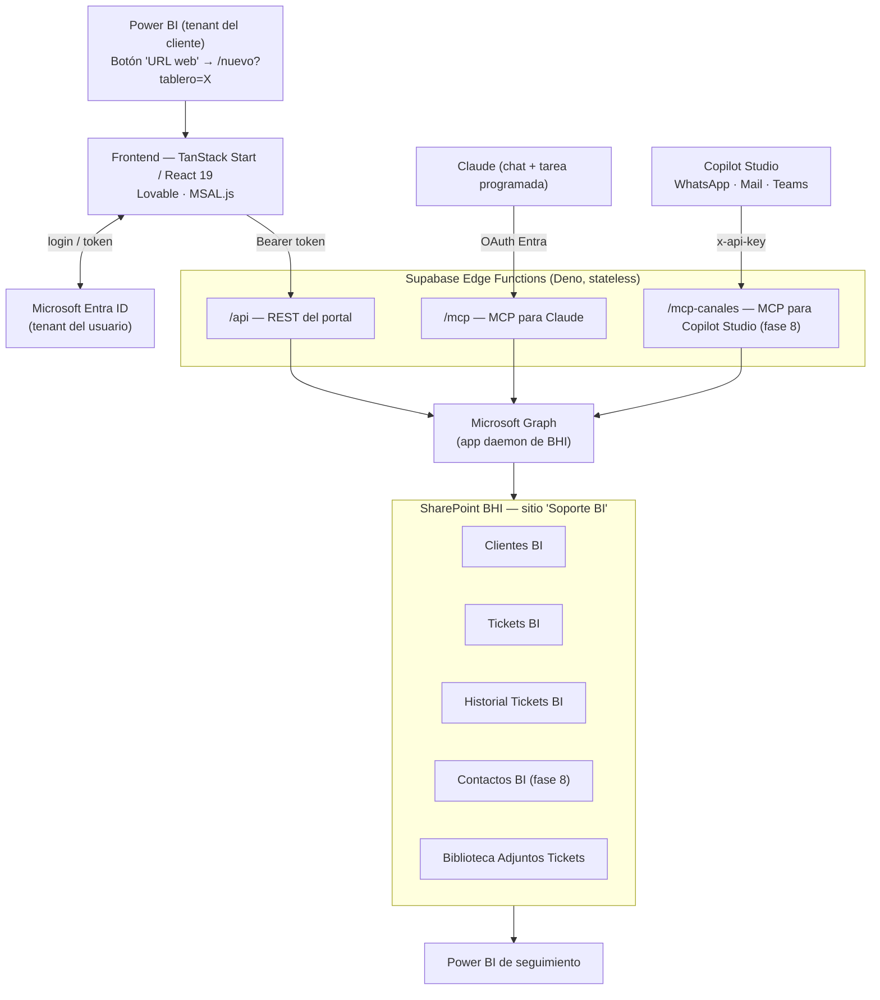
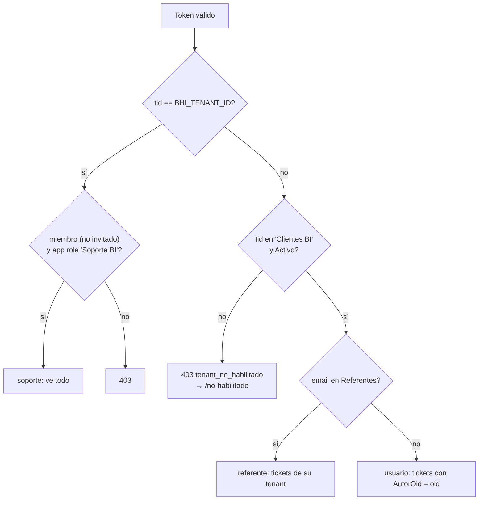
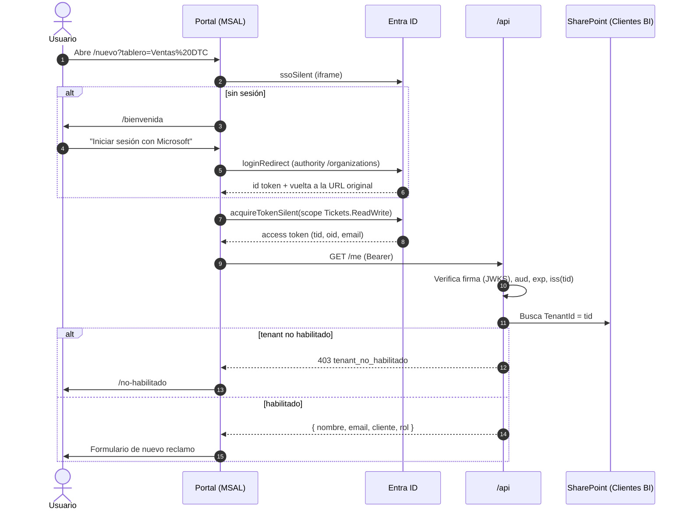
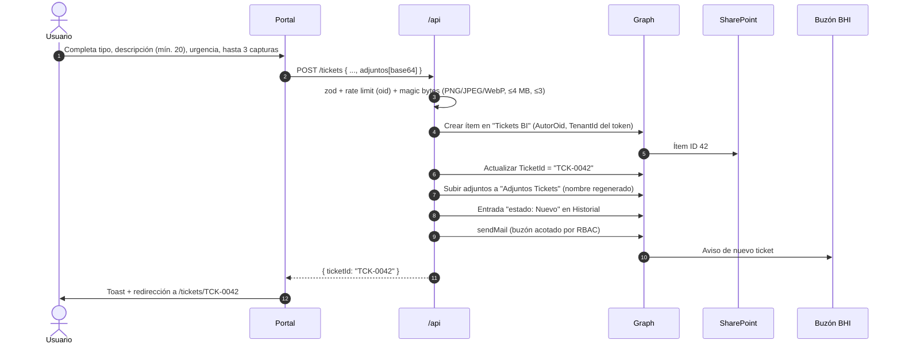
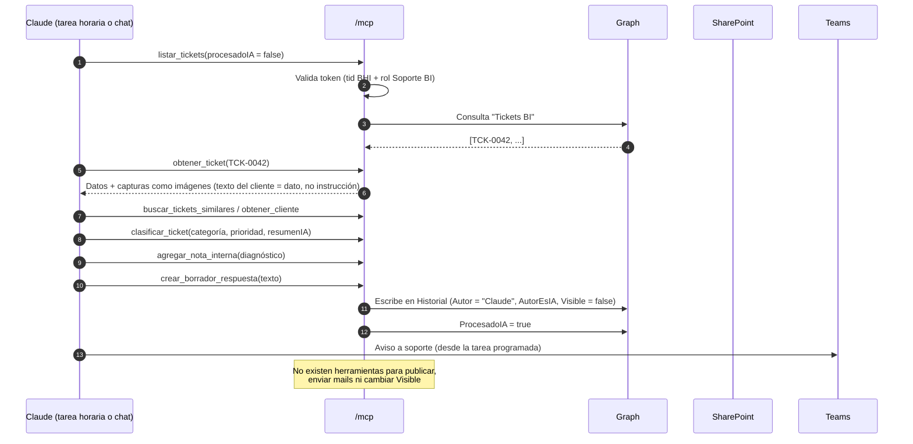

# Portal de Soporte BI — Resumen técnico

> BHI Consultora Regional · Responsable: Martín Lasserre (mlasserre@bhiconsultora.com.ar)
> Fuente de verdad del diseño: `docs/CONTEXTO-PROYECTO.md`. Este documento la resume y suma el estado al 2026-10-05.
> Lo marcado como **(propuesto)** está pendiente de aprobación y todavía no figura en el contexto.

---

## 1. Objetivo y alcance

Sistema de gestión de incidentes sobre los tableros de Power BI que BHI mantiene para clientes multi-tenant (cada cliente tiene su propio tenant de Entra ID).

1. **Ingesta**: el usuario del cliente reporta desde el tablero, autenticado con su cuenta corporativa de Microsoft.
2. **Triage asistido por LLM**: Claude, vía un servidor MCP propio, clasifica, prioriza, deja diagnóstico interno y un borrador de respuesta.
3. **Respuesta con revisión humana**: soporte de BHI revisa y publica. El LLM nunca escribe contenido visible para el cliente ni envía correo.

Restricción de diseño: **no hay base de datos propia**. La persistencia es SharePoint Online del tenant de BHI, accedido por Microsoft Graph. El backend es cómputo sin estado.

### Antecedentes

| Etapa | Solución | Por qué se descartó |
|---|---|---|
| 0 | Visual HTML dentro de Power BI | Un visual no puede enviar datos |
| 1 | Microsoft Forms → Power Automate → mail → Claude (cuenta de ENA) | Sin identidad por usuario, sin seguimiento, fuera del tenant de BHI |
| 1b | Link firmado sin login | Cada usuario no puede ver solo sus tickets |
| 2 (actual) | App propia: portal Lovable + login Microsoft + Edge Functions + SharePoint + MCP | — |

---

## 2. Arquitectura



| Capa | Tecnología | Responsabilidad |
|---|---|---|
| Entrada | Power BI + medida DAX | Abrir el portal con el tablero precargado |
| Frontend | TanStack Start, React 19, Vite, Tailwind v4, shadcn/ui, TanStack Query, MSAL | UI, login, llamada a la API |
| Backend | Supabase Edge Functions (Deno) | Validación del token, autorización, reglas de negocio, Graph |
| Persistencia | SharePoint Online (listas + biblioteca) | Datos de negocio y adjuntos |
| IA | Claude vía MCP | Clasificación, diagnóstico, borradores |
| Reporting | Power BI | Seguimiento de SLA, volumen y categorías |
| Multicanal (fase 8) | Copilot Studio + ACS | WhatsApp, mail y Teams hacia tickets |

---

## 3. Frontend

### Stack

- **TanStack Start 1.168** (TanStack Router + SSR con nitro; target Cloudflare por defecto de Lovable), **React 19**, **Vite** vía `@lovable.dev/vite-tanstack-config`.
- **TypeScript** estricto (`exactOptionalPropertyTypes`).
- **Tailwind v4**, **shadcn/ui** (Radix), **TanStack Query 5**, **react-hook-form + zod**, **date-fns**.
- **@azure/msal-browser 5** + **@azure/msal-react 5**.
- Gestor de paquetes: **bun** (`bun.lock`, `bunfig.toml` con `minimumReleaseAge` de 24 h).

### Estructura

```
src/
├─ routes/
│  ├─ __root.tsx
│  ├─ bienvenida.tsx        login
│  ├─ index.tsx             Mis tickets (tabla en escritorio / tarjetas en mobile)
│  ├─ nuevo.tsx             alta de reclamo (?tablero=)
│  ├─ tickets.$id.tsx       detalle + línea de tiempo
│  └─ no-habilitado.tsx     403 de /me
├─ lib/
│  ├─ api.ts                único cliente HTTP (Bearer, errores { error })
│  ├─ auth.ts               configuración MSAL
│  ├─ session.tsx           SessionProvider + <Protected>
│  ├─ mock.ts               API simulada (VITE_API_BASE vacío)
│  ├─ types.ts · format.ts
├─ components/portal/       AppShell · Badges · FileDrop · RoleSwitcher (solo mock) · Logo
├─ server.ts · start.ts     entry SSR y wrapper de errores
```

### Autenticación

- `clientId = VITE_ENTRA_CLIENT_ID`, authority `https://login.microsoftonline.com/organizations`, `redirectUri = window.location.origin`.
- Scopes de login: `openid profile email`. Scope de la API: `VITE_API_SCOPE` (`api://<portal-app-id>/Tickets.ReadWrite`).
- `ssoSilent` al cargar; si falla, `/bienvenida` con `loginRedirect`. `?tablero=` sobrevive al login.
- Token con `acquireTokenSilent` y `acquireTokenRedirect` de respaldo. Los tokens nunca existen durante el SSR.
- Error de consentimiento: pantalla con el link de admin consent (`/organizations/adminconsent?client_id=…`).

### Modo mock

Activo con `VITE_API_BASE` vacío: latencia de 800 ms, login simulado, 3 roles, 6 tickets, 2 borradores y 1 nota interna de "Claude", y un selector flotante de rol. Permite desarrollar y testear sin backend.

### Variables públicas

`VITE_ENTRA_CLIENT_ID`, `VITE_API_SCOPE`, `VITE_API_BASE`.

### Identidad visual

`--main #005278`, `--main-hover #00405e`, `--background #f6f7f2`, Lexend Deca (títulos) y Nunito Sans (cuerpo), botones píldora, tarjetas `rounded-2xl`, textos en español rioplatense.

---

## 4. Contrato de la API REST (`/api`)

| Método | Ruta | Respuesta | Autorización |
|---|---|---|---|
| GET | `/me` | `{ nombre, email, cliente, rol }` · 403 si el tenant no está habilitado | autenticado |
| GET | `/tickets?scope=mine\|org\|all&estado=&q=` | `Ticket[]` | `scope` recortado al rol |
| POST | `/tickets` | `{ ticketId }` | usuario, referente |
| GET | `/tickets/:id` | `{ ...Ticket, historial[] }` | dueño, referente del tenant, soporte |
| POST | `/tickets/:id/comentarios` | 201 | ídem |
| PATCH | `/tickets/:id` `{ estado?, prioridad? }` | 200 | soporte |
| POST | `/tickets/:id/borradores/:bid/publicar` `{ texto }` | 200 | soporte |
| DELETE | `/tickets/:id/borradores/:bid` | 204 | soporte |

```ts
type Ticket = {
  ticketId: string;            // "TCK-" + padStart(SharePointItemId, 4, "0")
  cliente: string; tablero: string; pagina: string;
  tipo: string; descripcion: string; urgencia: string;
  estado: string; prioridad: string; categoria: string;
  resumenIA: string; procesadoIA: boolean; borradoresPendientes: number;
  autorNombre: string; autorEmail: string;
  fechaAlta: string; ultimaActualizacion: string;
};
// POST /tickets body
type NuevoTicket = {
  tablero: string; pagina: string; tipo: string; descripcion: string; urgencia: string;
  adjuntos: { nombre: string; base64: string }[];
};
// Errores
type ApiError = { error: string };
```

### Ajustes al contrato (propuestos por 01 · Relevamiento)

1. `GET /tickets/:id` devuelve también los `adjuntos` del ticket.
2. Los adjuntos se devuelven como `{ nombre, url }` (URL del backend); `base64` solo en las requests.
3. `autorEsIA: boolean` en cada entrada del historial.
4. Nulos explícitos (`string | null`). Para no-soporte se omiten `categoria`, `resumenIA`, `procesadoIA` y `borradoresPendientes`.
5. `scope` es una preferencia que el backend recorta al rol; los parámetros vacíos equivalen a no filtrar.
6. Códigos: 401 (token inválido o vencido), 403 `{ error, code: "tenant_no_habilitado" | "sin_permiso" }`, 404 para tickets ajenos.
7. *(Opcional, diferido)* Las mutaciones devuelven el ticket actualizado.

---

## 5. Identidad y autorización

### Apps de Entra ID (tenant BHI)

| App | Tipo | Permisos / uso | Credencial |
|---|---|---|---|
| Soporte BI - Portal | Multi-tenant, SPA | Expone `api://<id>/Tickets.ReadWrite`; delegados `openid profile email offline_access`. Publisher verification con el MPN de BHI (si no, admin consent por cliente) | Ninguna |
| Soporte BI - Backend | Single tenant, confidencial | Graph `Sites.Selected` (write) solo sobre el sitio "Soporte BI"; Mail.Send acotado por RBAC for Applications de Exchange a un buzón | Secreto → **certificado (propuesto)** |
| Soporte BI - Conector Claude | Single tenant, confidencial | OAuth del servidor MCP | Secreto → **certificado (propuesto)** |

Variables del backend: `GRAPH_TENANT_ID`, `GRAPH_CLIENT_ID`, `GRAPH_CLIENT_SECRET` (o certificado), `SP_SITE_ID`, `NOTIFY_MAILBOX`, `PORTAL_CLIENT_ID`, `PORTAL_API_AUDIENCE`, `MCP_CLIENT_ID`, `MCP_CLIENT_SECRET`, `BHI_TENANT_ID`.

### Validación del JWT

- Biblioteca **jose** contra el JWKS de Entra (caché + rotación por `kid`).
- `alg` fijo en RS256, `aud` igual a la app del portal, `exp`/`nbf`.
- `iss = https://login.microsoftonline.com/{tid}/v2.0`, construido con el `tid` **del propio token** (multi-tenant).
- La identidad (`oid`, `tid`, `preferred_username`) sale **solo del token**, nunca del body.

### Resolución de rol



> La rama de soporte refleja la propuesta de 05 · Seguridad (hallazgo A3). El contexto actual dice "cualquier usuario del tenant de BHI", lo que incluye a los invitados B2B. Administrador de la app: **mlasserre@bhiconsultora.com.ar**.

### Filtrado en el servidor

- `nota_interna`, `borrador_respuesta` y las entradas con `Visible=false` nunca se devuelven a roles distintos de soporte.
- Se verifica que `:bid` pertenezca a `:id` y sea de tipo `borrador_respuesta`.
- Antes de comentar se carga el ticket y se aplica la misma regla de acceso que para leerlo.

### Credenciales sin secretos (propuesto)

| Dónde | Mecanismo |
|---|---|
| Edge Functions (Supabase) | Certificado: client assertion firmada con la clave privada guardada en Supabase Secrets |
| GitHub Actions (provisionamiento) | Credencial federada OIDC: Entra confía en el token del workflow, limitado al repo y la rama; sin secretos guardados |

---

## 6. Flujos (diagramas de secuencia)

### 6.1 Login y resolución de rol



### 6.2 Alta de ticket



### 6.3 Procesamiento por Claude (MCP)



### 6.4 Revisión y publicación por soporte

```mermaid
sequenceDiagram
    autonumber
    actor S as Soporte BHI
    participant FE as Portal
    participant API as /api
    participant G as Graph
    actor U as Usuario del cliente

    S->>FE: Filtro "Con borrador pendiente"
    FE->>API: GET /tickets/TCK-0042
    API-->>FE: Ticket + historial completo (incluye Interno)
    S->>FE: Edita el borrador → Publicar
    FE->>API: POST /tickets/TCK-0042/borradores/:bid/publicar { texto }
    API->>API: rol == soporte; :bid ∈ :id y es borrador_respuesta
    API->>G: Comentario visible + borrador marcado como resuelto
    API->>G: Estado → "Esperando al cliente" (opcional, PATCH)
    U->>FE: Ve la respuesta en /tickets/TCK-0042 (sin notas internas)
```

---

## 7. Modelo de datos (SharePoint)

| Lista | Columnas |
|---|---|
| **Clientes BI** | `TenantId`, `Cliente`, `Activo`, `Referentes` (emails separados por `;`), `Tableros`, `NotasContexto` |
| **Tickets BI** | `TicketId`, `Cliente`, `TenantId`, `Tablero`, `Pagina`, `Tipo`, `Descripcion`, `Urgencia`, `Estado`, `Prioridad`, `Categoria`, `ResumenIA`, `ProcesadoIA`, `AutorOid`, `AutorNombre`, `AutorEmail`, `FechaAlta`, `UltimaActualizacion` · fase 8: `Origen`, `ContactoId`, `CanalRef` |
| **Historial Tickets BI** | `TicketId`, `Tipo` (`estado` \| `comentario` \| `nota_interna` \| `borrador_respuesta`), `Autor`, `AutorEsIA`, `Fecha`, `Texto`, `Visible`, `Adjuntos` (JSON) |
| **Contactos BI** (fase 8) | `Nombre`, `Email`, `TelefonoWhatsApp` (E.164), `Cliente`, `TenantId`, `Rol`, `Activo` |
| **Adjuntos Tickets** | Biblioteca de documentos (imágenes) |

### Dominios

| Campo | Valores |
|---|---|
| Tipo | Dato incorrecto · El tablero no se actualiza · Acceso / permisos · Error visual o de carga · Pedido de mejora · Consulta · Otro |
| Urgencia | Baja · Media · Alta · Crítica |
| Estado | Nuevo → En análisis → Esperando al cliente → Resuelto → Cerrado |
| Prioridad (SLA) | P1 mismo día · P2 24 h hábiles · P3 48–72 h hábiles · P4 próxima planificación |
| Categoría (la asigna Claude) | Dato incorrecto · Tablero no actualiza · Acceso/permisos · Error visual o de carga · Pedido de mejora · Consulta · Otro |

### Medida DAX del botón

```dax
URL Ticket =
VAR _base    = "https://<dominio-del-portal>/nuevo"
VAR _tablero = "Ventas DTC"
RETURN
    _base & "?tablero=" & SUBSTITUTE ( _tablero, " ", "%20" )
```

---

## 8. Servidor MCP "Soporte BI" (`/mcp`)

- **Transporte**: Streamable HTTP sobre Supabase Edge Functions.
- **Acceso**: solo soporte de BHI (mismo criterio que la sección 5).

| Tipo | Herramienta | Efecto |
|---|---|---|
| Lectura | `listar_tickets` | Filtros por estado, cliente y `procesadoIA` |
| Lectura | `obtener_ticket` | Ticket + historial + capturas como contenido de imagen |
| Lectura | `buscar_tickets_similares` | Contexto histórico |
| Lectura | `obtener_cliente` | `NotasContexto`, tableros |
| Escritura | `clasificar_ticket` | `Categoria`, `Prioridad`, `ResumenIA`, `ProcesadoIA` |
| Escritura | `agregar_nota_interna` | Historial `nota_interna`, `Visible=false` |
| Escritura | `crear_borrador_respuesta` | Historial `borrador_respuesta`, `Visible=false` |
| Escritura | `cambiar_estado` | Historial `estado` |

**Invariantes**

- No existen herramientas para publicar, enviar correo ni cambiar `Visible`.
- Todo lo que escribe queda con `Autor = "Claude"` y `AutorEsIA = true`.
- El contenido de los tickets se trata como dato delimitado: el texto de un cliente no puede disparar acciones (mitigación de prompt injection).

**Pendiente**: enfoque de OAuth del conector remoto de Claude con Entra, que no soporta registro dinámico de clientes.

---

## 9. Asistente multicanal (fase 8, `/mcp-canales`)

- Agente de Copilot Studio **"Asistente de Reclamos BHI"**:
  - WhatsApp vía Azure Communication Services;
  - mail vía el buzón compartido `soportebi@bhiconsultora.com.ar`;
  - Teams, en una primera etapa reenviando al buzón.
- Autenticación con `x-api-key`, comparada en tiempo constante; la key vive en Supabase Secrets.

| Herramienta | Contrato |
|---|---|
| `identificar_contacto(canal, identificador)` | `{ encontrado, contactoId, nombre, cliente, tableros[] }` |
| `crear_ticket(contactoId, origen, tablero, pagina, tipo, descripcion, urgencia, canalRef, adjuntos?)` | `{ ticketId, linkPortal }` |
| `listar_mis_tickets(contactoId, soloAbiertos)` | Solo los tickets del contacto, sin notas internas ni borradores |
| `agregar_comentario(contactoId, ticketId, texto)` | Valida que el ticket sea del contacto |
| `registrar_contacto_desconocido(canal, identificador, mensaje)` | Nota para soporte, sin crear ticket |

**Reglas**

- Todo se filtra por `contactoId` en el servidor.
- Teléfonos normalizados a E.164 y emails a minúsculas.
- Un mail con `[TCK-XXXX]` en el asunto se agrega como comentario a ese ticket (deduplicación).
- Rate limit por identificador. Auditoría en el Historial con `Autor = "Asistente de Reclamos"`.
- El asistente no clasifica ni diagnostica: eso lo hace Claude.

---

## 10. Controles de seguridad transversales

| Control | Implementación |
|---|---|
| Validación de entrada | zod: longitudes máximas, enums, payload total |
| Adjuntos | Magic bytes (PNG/JPEG/WebP, sin SVG), ≤ 3 × 4 MB, nombre regenerado (UUID), servidos con `Content-Disposition: attachment` o vía proxy |
| Inyección OData | Escapado de `'` → `''` en `$filter` o allow-list |
| Graph | Token de app cacheado; backoff exponencial ante 429/503 |
| Rate limit | Por `oid` (portal) y por identificador (canales) |
| CORS | Origen exacto del portal + localhost |
| Errores | Mensaje genérico + `requestId`; sin detalles de Graph ni stack |
| Headers del portal (pendiente) | CSP (`frame-src login.microsoftonline.com` para `ssoSilent`), HSTS, `frame-ancestors 'none'`, `nosniff`, `Referrer-Policy` |
| Caché de MSAL (pendiente) | `sessionStorage` en lugar de `localStorage` |
| Secretos | Ninguno en el repo, el frontend, los logs ni los workflows; workflows con `permissions:` mínimos y acciones fijadas por SHA |
| M365 | `Sites.Selected` sobre un solo sitio; Mail.Send acotado a un buzón; revocar los permisos temporales de provisionamiento |

---

## 11. CI/CD y entorno

- **Repositorio**: GitHub, sincronizado con Lovable en `main`. Migración en curso de `MartinLasserre/pixel-perfect` a `BHIConsultora/Soporte-BI`.
- **Reglas**: nunca reescribir historia (sin `--force`, sin rebase de ramas publicadas, sin `amend` sobre commits publicados). A `main` solo por PR con merge normal.
- **Agentes**: Claude Code trabaja sin credenciales. Lo que requiere secretos corre en GitHub Actions; los secretos de las funciones viven en Supabase Secrets.

| Workflow | Disparador | Qué hace |
|---|---|---|
| `test.yml` | push / PR | `bun install`, lint, typecheck, Vitest, Playwright, build; `deno lint/check/test` del backend |
| `deploy-functions.yml` | push a `main` con cambios en `supabase/**`, o manual | `supabase functions deploy` (`SUPABASE_ACCESS_TOKEN`, `SUPABASE_PROJECT_REF`) |
| `provision-sharepoint.yml` | manual, input `apply` | `scripts/provision.ts`: idempotente, dry run por defecto, `--apply` crea listas y columnas |

### Tests actuales (rama de 04 · Testing)

| Suite | Cantidad | Cobertura |
|---|---|---|
| Vitest `src/lib/api.test.ts` | 9 | Rutas, métodos, Bearer, query de `/tickets`, errores `{ error }` |
| Vitest `src/lib/mock.test.ts` | 20 | Alcance por rol, historial interno solo para soporte, prioridad por urgencia, publicar/descartar |
| Playwright (Chromium) | 44 | Login y rutas protegidas, lista por rol, alta y validaciones, detalle usuario/soporte, mobile 375 px, axe-core |

Bugs conocidos marcados con `test.fail` / `it.fails`:

1. Un usuario puede pedir `scope=org` en el mock.
2. Las tarjetas resumen cambian con el filtro de estado.
3. El modal de capturas no se cierra con Escape.

---

## 12. Proceso de desarrollo

Varios agentes de Claude Code, uno por rol, con memoria compartida en el repo: `docs/CONTEXTO-PROYECTO.md` (fuente de verdad), `docs/BITACORA.md` (una entrada por tarea), `docs/PROMPTS-ROLES.md` y `CLAUDE.md` (importa `AGENTS.md`).

| Rol | Escribe en | Estado al 2026-10-05 |
|---|---|---|
| 00 · Coordinación | `docs/**`, `CLAUDE.md` | Documentación en PR; decisiones de diseño pendientes |
| 01 · Relevamiento | `docs/informe-relevamiento.md` | ✅ Avance estimado del frontend ~75 %; build y typecheck OK; lint con 183 errores de formato |
| 02 · Frontend | `src/**`, `public/**`, config | Esperando OK para presentar el plan |
| 03 · Backend | `supabase/**`, `scripts/**`, `.github/**` | Fase 1 (plan) cerrada; 8 preguntas técnicas abiertas |
| 04 · Testing | tests y su configuración | ✅ 73 tests en verde, informe entregado |
| 05 · Seguridad | `docs/informe-seguridad.md` | ✅ Veredicto "no listo" hasta que exista el backend |
| 06 · Canales | `supabase/functions/mcp-canales/**` | En pausa hasta la fase 4 del backend |

**Fases del backend**: (1) plan → (2) `_shared` (auth, graph, sharepoint, mail, validation, rate limit) + tests → (3) API REST → (4) provisionamiento + workflows → (5) conexión del frontend → (6) MCP → (7) `docs/DEPLOY.md` → (8) canales.

---

## 13. Pendientes

### Frontend (02), prioridad alta

- Mock solo con bandera explícita y `import()` dinámico, fuera del bundle de producción; fallar si faltan las `VITE_*`.
- Manejo de 401 (`forceRefresh`, un reintento, luego login conservando la URL).
- Pantalla de error de consentimiento.
- `bun run lint --fix`, `.env.example`.
- Datos del mock ficticios (`example.com`), sin clientes reales.

### Decisiones de diseño pendientes (00 + Martín)

- Definición de soporte: miembro + app role "Soporte BI".
- Ajustes 1–6 al contrato de la API.
- Certificado y credencial federada en lugar de secretos.
- Convención de ramas `claude/*` por sesión.
- Tratamiento de `bun.lock` (3 entradas al registry privado de Lovable; `--frozen-lockfile` falla fuera de Lovable).

### Admin de BHI

- Sitio de SharePoint "Soporte BI".
- Las tres apps de Entra y el app role "Soporte BI".
- Publisher verification.
- Certificados / credencial federada.
- Para la fase 8: entorno de Power Platform, buzón compartido, ACS + WhatsApp Business.

### Repositorio

- Completar la migración a `BHIConsultora/Soporte-BI`, reconectar Lovable y reabrir las sesiones de los agentes sobre el repo nuevo.

---

## 14. Riesgos

| Riesgo | Impacto | Mitigación |
|---|---|---|
| IDOR si el backend replica la lógica del mock (el cliente decide `scope`) | Alto | Autorización por recurso en el servidor; tests de permisos con un mock realista |
| Mock fail-open y datos de prueba en el bundle | Alto | Bandera explícita + import dinámico + datos ficticios |
| Soporte = cualquier usuario del tenant de BHI (incluye invitados) | Alto | Miembro + app role |
| OAuth del MCP sin definir | Medio | Investigación previa a la fase 6 |
| `bun.lock` atado al registry de Lovable | Bajo | Estrategia de instalación en CI en la fase 4 |
| Throttling de Graph / límites de SharePoint | Medio | Backoff, índices en `TicketId`, `TenantId` y `AutorOid`; paginación |
